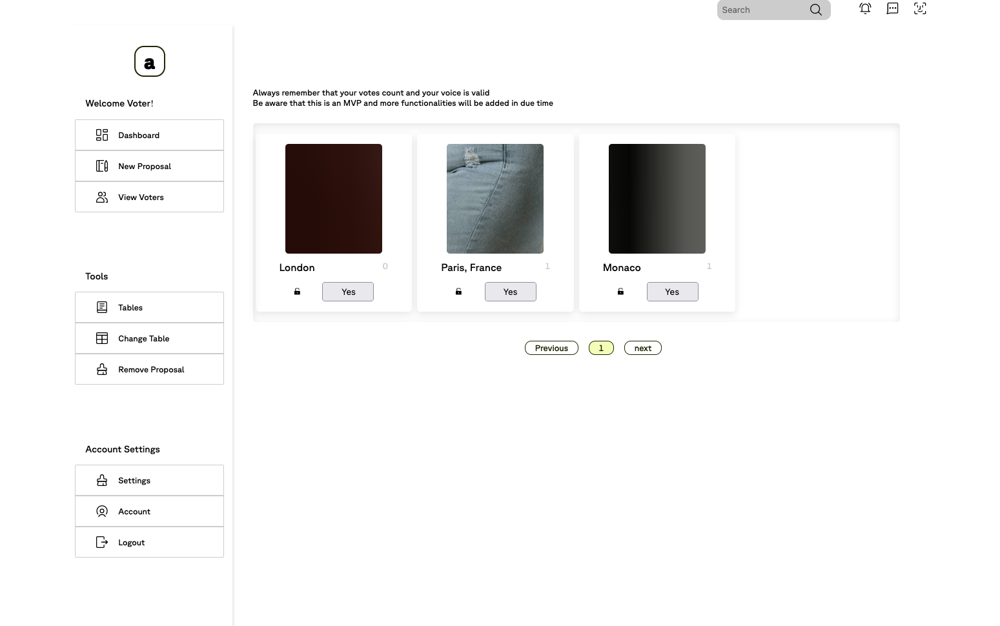

This project is a simple Voting System. 
It comes with a simple contract, and basic interactions to the contract. 
It was built using React, Hardhat, SASS. 
 
## 🛠 Installation and Setup

1. Install Hardhat
```
npm install --save-dev hardhat
```
2. Insall Web3Modal
```
npm i web3modal
```
3. Install SASS
```
npm install sass
```
4. Install React-Icons
```
npm install react-icons
```

### ⚙️ Starting a test node
```
npx hardhat node
npx hardhat run --network localhost scripts/deploy.js
npm start
```
### 🚨 This project is a working process and will recieve continuos changes as required
